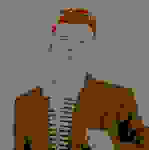

# Image to NES Palette Converter

This Go program transforms an image to mimic the classic NES (Nintendo Entertainment System) color palette. It achieves this by iterating through each pixel of an input image and finding the closest color in a predefined NES color palette.

---

## How it Works

The program consists of the following key components:

* **`NesPalette`**: This is a global variable holding a slice of `color.RGBA` structs, defining the specific colors of the NES palette.
* **`closestColor(c color.Color)`**: This function takes a `color.Color` as input and iterates through the `NesPalette`. It calculates the Euclidean distance in RGB space between the input color and each palette color. The palette color with the minimum distance is returned as the closest match.
* **`applyNESColorPalette(img image.Image)`**: This function takes an `image.Image` as input. It creates a new `image.RGBA` with the same bounds as the input image. Then, it iterates through every pixel of the input image, finds the closest NES palette color using `closestColor`, and sets the corresponding pixel in the new image to that closest color.
* **`main()`**:
    * Opens an image file named `reck.jpg`.
    * Decodes the image.
    * Applies the NES color palette transformation using `applyNESColorPalette`.
    * Creates a new output file named `output2.jpg`.
    * Encodes the transformed image as a JPEG with a quality setting of 2 (which can result in a more pixelated, retro look).
    * Prints a success message.

---

## Getting Started

### Prerequisites

* **Go (Golang)** installed on your system.

### Installation

1.  **Save the code**: Save the provided Go code as a `.go` file (e.g., `nes_palette.go`).
2.  **Place your image**: Make sure you have an image file named `reck.jpg` in the same directory as your Go program. You can use your own image by renaming it to `reck.jpg` or updating the `os.Open("reck.jpg")` line in the `main` function.

### Running the Program

1.  **Open your terminal or command prompt.**
2.  **Navigate to the directory** where you saved your `nes_palette.go` file and `reck.jpg`.
3.  **Run the program** using the Go command:

    ```bash
    go run nes_palette.go
    ```

4.  After execution, a new image file named `output2.jpg` will be created in the same directory, containing your image with the NES color palette applied.

---

## Sample Images

Here's an example of an input image and its transformation to the NES color palette:

### Input Image


### Output Image (NES Palette)


